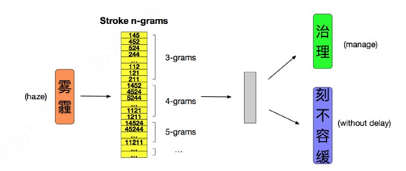
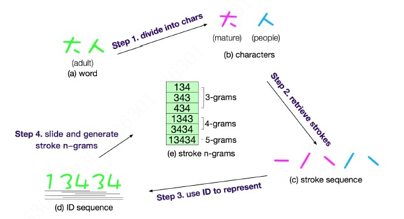

## cw2vec model by Gensim and PyTorch

本repo包含是 使用Pytorch和gensim实现cw2vec模型，主要参考根据该论文“[cw2vec: Learning Chinese Word Embeddings with Stroke n-gram Information](http://www.statnlp.org/wp-content/uploads/papers/2018/cw2vec/cw2vec.pdf) ”提出的cw2vec进行实现。

** note**:整体上看完该论文，基本上与Fasttext很相似，因此，我们只要根据Fasttetx进行实现。
- version1: 基于gensim模块中的fasttext进行实现，训练速度很快
- version2: 完全基于Pytorch框架进行实现cw2vec，虽然速度很慢，但可以理解其中的细节。

另外，pytorch实现的word2vec模型可以参考: [github](https://github.com/lonePatient/chinese-word2vec-pytorch)

### structure of the model

整个模型结构如下图所示:



整个数据构造方式如下图所示：



### Structure of the code

整个代码目录如下：

```text
├── pcw2vec
|  └── callback
|  |  └── lrscheduler.py　　
|  |  └── trainingmonitor.py　
|  |  └── ...
|  └── config
|  |  └── basic_config.py #a configuration file for storing model parameters
|  └── dataset　　　
|  └── io　　　　
|  |  └── dataset.py　　
|  |  └── data_transformer.py　　
|  └── model
|  |  └── nn　
|  |  └── pretrain　
|  └── output #save the ouput of model
|  └── preprocessing #text preprocessing 
|  └── train #used for training a model
|  |  └── trainer.py 
|  |  └── ...
|  └── utils # a set of utility functions
├── train_cw2vec.py   # pytorch版本
├── get_similar_word.py # 计算相似度
├── train_gensim_cw2vec.py # gensim版本
```
### Dependencies

- csv
- tqdm
- numpy
- pickle
- gensim
- scikit-learn
- PyTorch 1.0
- matplotlib

### How to use the code

1. 准备训练数据并放在`pycw2vec/dataset/raw`目录下
2. 对`pycw2vec/config`路径下的配置文件进行相应的修改（比如数据路径。模型参数等）
3. 运行命令`python train_gensim_cw2vec.py` 进行cw2vec模型训练
4. 运行命令`python get_similar_word.py` 得到词对应的相似结果，默认是返回top10结果

###  result

```text
<<<<<<<<<<<<<<<<<<<<<
中国
中国 : 1.000
中国区 : 0.913
我国 : 0.900
大国 : 0.899
中国队 : 0.898
美国 : 0.897
韩国 : 0.893
中国史 : 0.893
国 : 0.886
齐国 : 0.884
>>>>>>>>>>>>>>>>>>>>>
<<<<<<<<<<<<<<<<<<<<<
男人
男人 : 1.000
男孩 : 0.901
男生 : 0.873
男孩子 : 0.867
女人 : 0.866
女孩 : 0.861
男女生 : 0.851
女生 : 0.840
男伴 : 0.833
男女 : 0.827
>>>>>>>>>>>>>>>>>>>>>
<<<<<<<<<<<<<<<<<<<<<
女人
女人 : 1.000
男人 : 0.866
女孩 : 0.802
女色 : 0.797
男孩 : 0.791
女生 : 0.768
男孩子 : 0.759
女孩子 : 0.750
男生 : 0.743
女性 : 0.735
```

**note**:  在实验过程，发现对于中文stroke而言，embedding size的大小影响很大，如果embedding size设置很大，那么整个模型将会偏向于stroke，从而会造成很多不合理结果。
